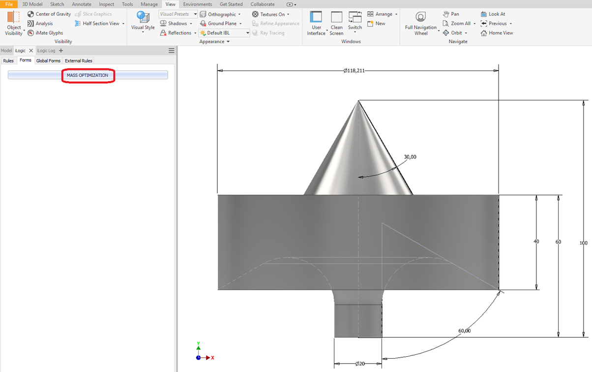
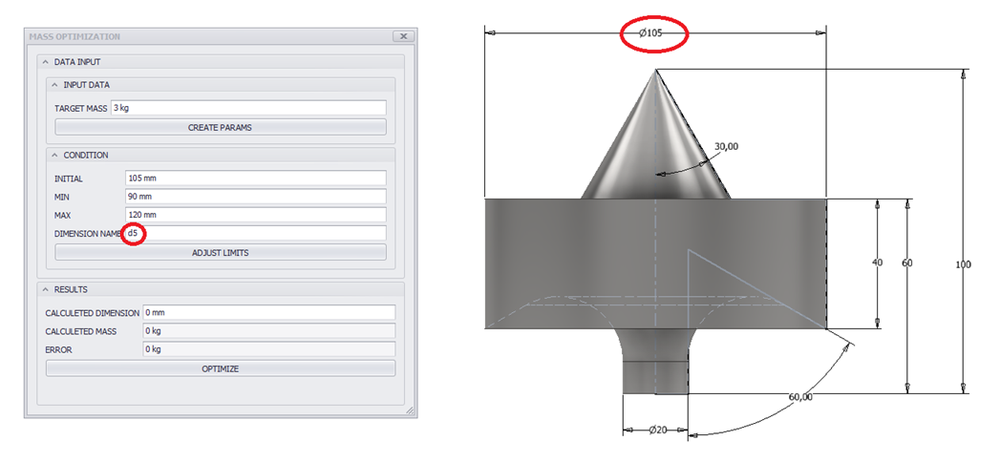
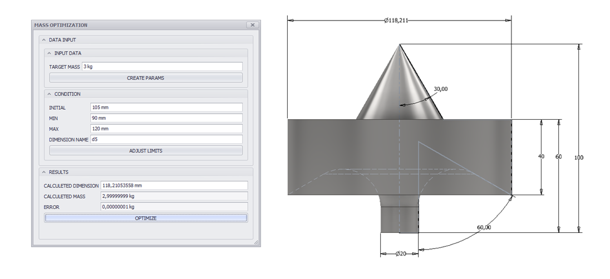

# Mass Optimization

One-dimensional optimization routine for adjusting the mass of Autodesk Inventor CAD models.

Normally, a CAD model's dimensions are defined first and its mass is calculated as a result. This project supports the inverse situation: the target mass is mandatory, while one model dimension may vary within defined limits.

The routine uses a golden-section search to adjust a selected Inventor parameter until the calculated mass approaches the target value.

## Example

The included part starts with a diameter of 105 mm. The diameter may vary between 90 mm and 120 mm to reach a target mass of 3 kg.

## Files

- `src/CreateParameters.vb`: creates the user parameters required by the routine.
- `src/AdjustLimits.vb`: recalculates the search interval around the latest result.
- `src/OptimizeMass.vb`: performs the golden-section search.
- `example/MassOptimization.ipt`: Autodesk Inventor example model.
- `docs/images/`: usage screenshots.

## How to use

1. Open `example/MassOptimization.ipt` in Autodesk Inventor.
2. Open the **iLogic Form** panel.
3. Select **MASS OPTIMIZATION**.
4. On the first run, click **CREATE PARAMS**.
5. Enter the desired value in **TARGET MASS**.
6. Click **OPTIMIZE**.
7. If necessary, click **ADJUST LIMITS** and run **OPTIMIZE** again to refine the result.

## Screenshots

---

# Otimização de massa

Rotina de otimização unidimensional para ajustar a massa de modelos CAD no Autodesk Inventor.

Normalmente, as dimensões de um modelo CAD são definidas primeiro e sua massa é calculada como resultado. Este projeto atende à situação inversa: a massa desejada é obrigatória, enquanto uma dimensão do modelo pode variar dentro de limites definidos.

A rotina utiliza uma busca pela seção áurea para ajustar um parâmetro selecionado do Inventor até que a massa calculada se aproxime do valor desejado.

## Exemplo

A peça incluída começa com um diâmetro de 105 mm. O diâmetro pode variar entre 90 mm e 120 mm para atingir uma massa desejada de 3 kg.

## Arquivos

- `src/CreateParameters.vb`: cria os parâmetros de usuário necessários para a rotina.
- `src/AdjustLimits.vb`: recalcula o intervalo de busca ao redor do último resultado.
- `src/OptimizeMass.vb`: executa a busca pela seção áurea.
- `example/MassOptimization.ipt`: modelo de exemplo do Autodesk Inventor.
- `docs/images/`: capturas de tela de utilização.

## Como utilizar

1. Abra `example/MassOptimization.ipt` no Autodesk Inventor.
2. Abra o painel **iLogic Form**.
3. Selecione **MASS OPTIMIZATION**.
4. Na primeira execução, clique em **CREATE PARAMS**.
5. Digite a massa desejada em **TARGET MASS**.
6. Clique em **OPTIMIZE**.
7. Se necessário, clique em **ADJUST LIMITS** e execute **OPTIMIZE** novamente para refinar o resultado.
